前回の記事でローカル上でHugoの環境構築を行い、静的サイトを生成してGitHubにgit pushするところまで記事にした。

- [Hugoでブログを構築した（HugoセットアップからGitHubにgit pushするまで） - klim0824.log()]( https://blog.klim0824.dev/post/2020/08/01/hugo_setup/ )

今回の記事では、GitHubとNetlify（無料枠）を連携させてgit pushする度にデプロイが行われるよう設定を行う。
基本的に公式ドキュメントの焼き直しなので、正確な情報は以下のURLから。なお、ここでは既にGitHubにソース一式をgit push済みという体で話を進めるため、一部公式ドキュメントとは異なる順番で解説する。


- [Host on Netlify | Hugo]( https://gohugo.io/hosting-and-deployment/hosting-on-netlify/ )

## Netlifyのアカウントを作成する

まずはブラウザでNetlifyのログイン画面に進む。

- [Welcome to Netlify | Netlify]( https://app.netlify.com/ )

以下からはGitHubからログインした体で進めていいく。

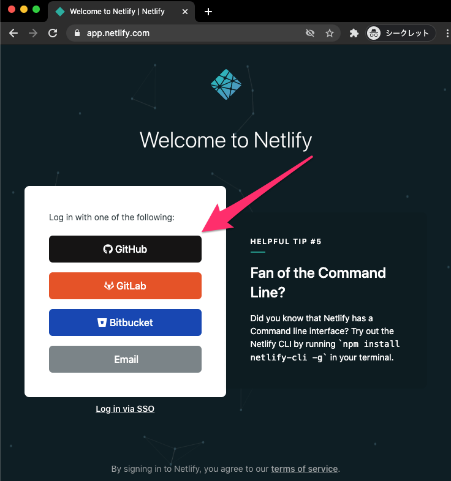

GitHubからの認証が求められるページに遷移するので、「Authorize netlify」をクリックする。

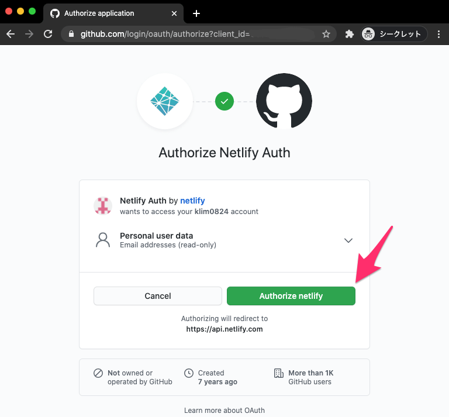

認証に成功すると。ダッシュボード画面に遷移する。初回はクイックガイドが表示されるので、ここは適当に。

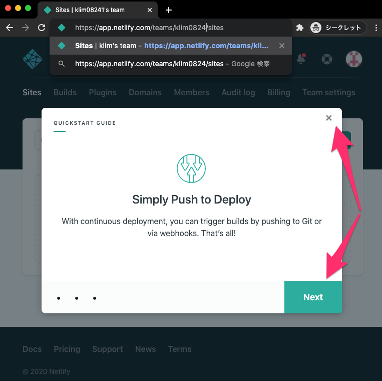


## NetlifyでHugoのバージョンを指定する

ここで一旦NetlifyにHugoのバージョンや設定を反映するために、Hugoで構築したサイトのソースにファイルを追加する。
ここでファイルを追加したりバージョン指定を行わないと、ローカルとデプロイ先とで見た目が異なるというような状況に陥ることがある（陥った筆者）。
まずはローカルにインストールしたHugoのバージョンを再度確認しよう。

```bash
$ hugo version
Hugo Static Site Generator v0.74.2/extended darwin/amd64 BuildDate: unknown
```


プロジェクトのルートディレクトリ（ `config.toml`が配置されているところ）に、 `netlify.toml` というファイルを配置する。

```bash
$ touch netlify.toml
```

`netlify.toml` の中身はこうなる。`HUGO_VERSION` の値に先程調べたHugoのバージョンを文字列で記載する（値はダブルクォーテーションで囲む必要があるようだ）。

```toml
[build]
  publish = "public"
  command = "hugo --gc --minify"

[context.production.environment]
  HUGO_VERSION = "0.74.2"
```

最終的にこのようなファイル/フォルダ構成になっているはず。


```bash
$ tree -a -L 1
.
├── .git
├── .gitmodules
├── archetypes
├── config.toml
├── content
├── data
├── layouts
├── netlify.toml   ←ココ!
├── resources
├── static
└── themes
```

最後に、 `netlify.toml` を `git push` しておく。


## サイトをビルド＆デプロイする

またブラウザで表示させたNetlifyのダッシュボードに戻る。

NetlifyとGitHubのレポジトリを連携するために、「New site from Git」というボタンをクリックする。

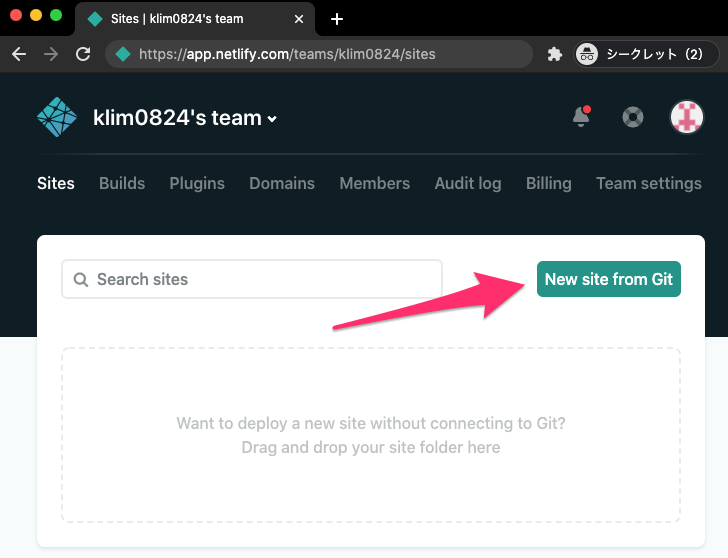

連携を進める画面に遷移するので、今回は「GitHub」をクリックする。

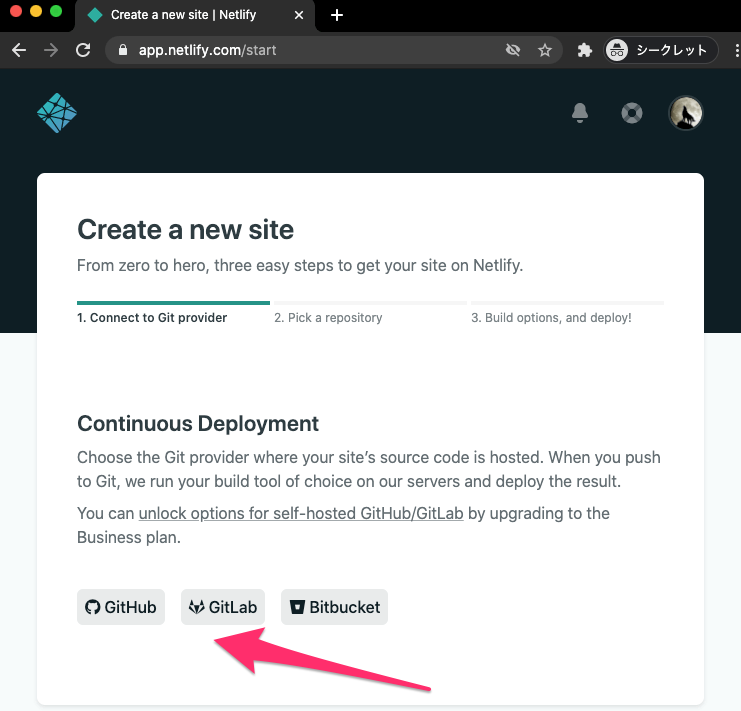

GitHubからNetlifyへパーミッションを与えるために「Authorize netlify」をクリックする。

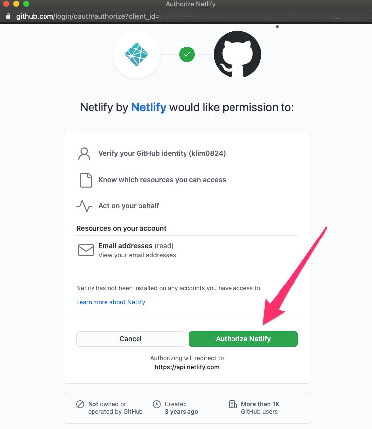

今度はGitHubアカウントにNetlifyをインストールする。

GitHub上のリポジトリの内、全てまたは個別にパーミッションを与えるかどうかを選択し、「Install」をクリックする。Netlifyにデプロイするリポジトリだけ選択すると、これ以降の画面がスッキリして分かりやすくなるだろう。

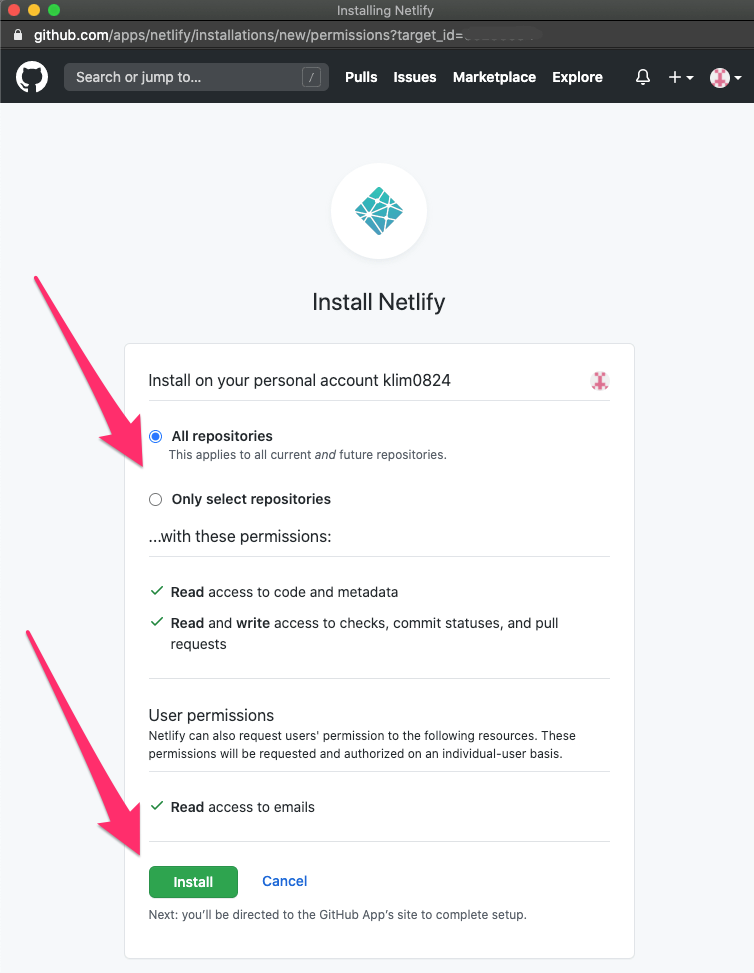

ここまで進めると、最初の画面に戻ったよような状態になることがある。こうなったら再度「GitHub」をクリックする。


Netlifyにデプロイさせたいリポジトリを選択する画面に遷移するので、該当するものをクリックする。

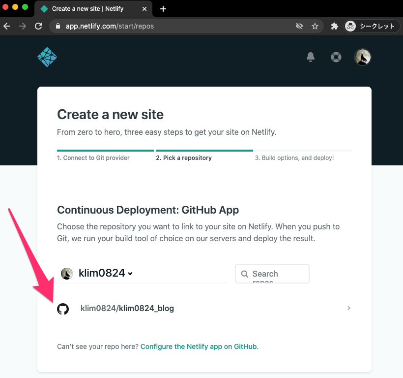

うまくいくと、ビルド＆デプロイが進んでいく。この状態で放置すると…

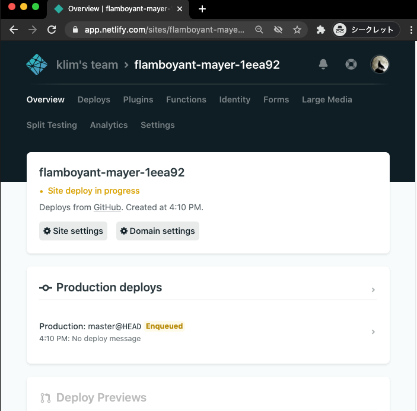

自動的にデプロイ先のURLが表示される（されなければリロードしても構わない）。

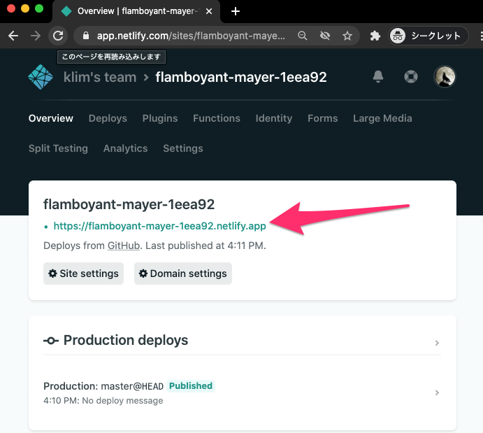

デプロイ成功！！

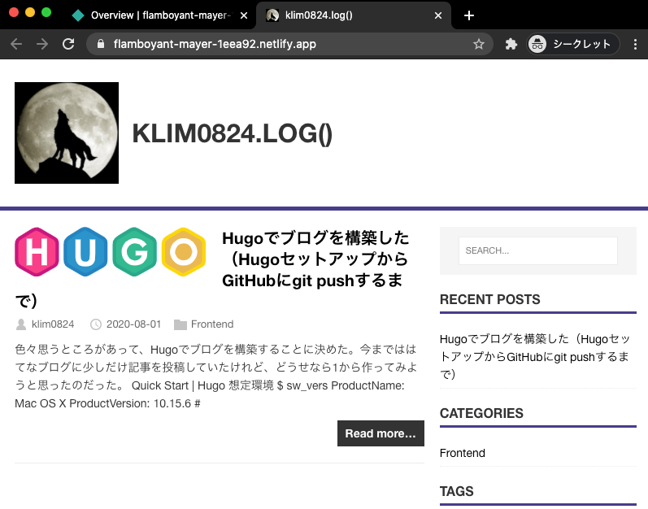


お疲れ様でした！！…と言いたいところだが、最後にいくつかやり残したことがある。


## `config.toml` にURLを設定する

前回の記事の中で `config.toml` の設定を行ったのだが、ここのbaseURLが `"http://example.org/"` のままになっている。このままだと画像等が適切に表示されないため、ここをデプロイ先のURLに書き換える必要がある。

```toml
baseURL = "http://example.org/"
languageCode = "ja"
title = "klim0824.log()"
theme = "mainroad"
```
これを以下のように書き換える。もちろんbaseURLの値は人によって異なるので、以下から直接コピペしてはいけない。

```toml
baseURL = "https://flanboyant-mayer-1eea92.netlify.app/"
languageCode = "ja"
title = "klim0824.log()"
theme = "mainroad"
```

この変更を `git commit` -> `git push` すると、再度ビルド＆デプロイが行われ、程なくしてNetlify上に反映されるだろう。

## （おまけ）サイトを削除する

もし何らかの理由でNetlify上からサイトを削除したい場合は、ヘッダーナビの `Settings` をクリックし、 `General` 項目の最も下にある `Danger zone` をクリックする。

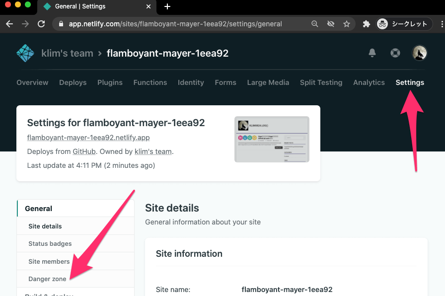


`Danger zone` の項目の中に `Delete this site` ボタンがあるのでクリック。

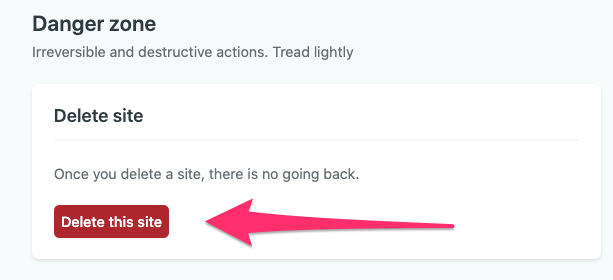

入力欄の中にデプロイ先のURLに含まれている固有名を示す文字列をコピペ入力し、最後に `Delete` ボタンをクリックするとサイトが削除される。


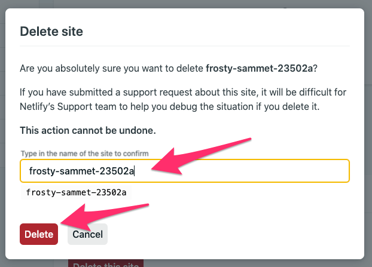


## 感想

NetlifyでサイトのCI/CD・ホスティングを行ってみたが、こんなにも手軽に（しかも無料！）進められるとは予想以上だった。所詮個人ブログなので今の所表示速度も申し分ないと感じているが、どうにもNetlifyの表示速度に関して色々と取り沙汰されているので、余裕があればホスティング先を変更してみるかもしれない。それまではしばらくNetlifyで運用していくことにする。


## 参考URL

- [Host on Netlify | Hugo]( https://gohugo.io/hosting-and-deployment/hosting-on-netlify/ )
- [静的サイトをNetlifyでホスティングする | AABrain]( https://aakira.app/blog/2018/06/netlify/ )
- [Netlifyの無料枠と料金に関してのまとめ - suzu6]( https://www.suzu6.net/posts/92-netlify-monthly/ )
- [Netlifyが日本からだと遅い - id:anatooのブログ]( https://blog.anatoo.jp/2020-08-03 )

