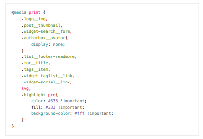
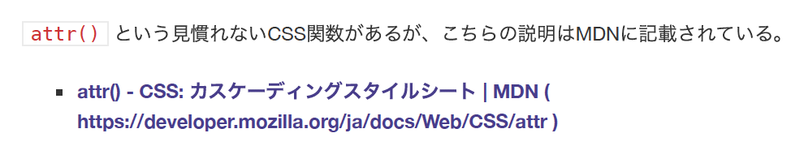
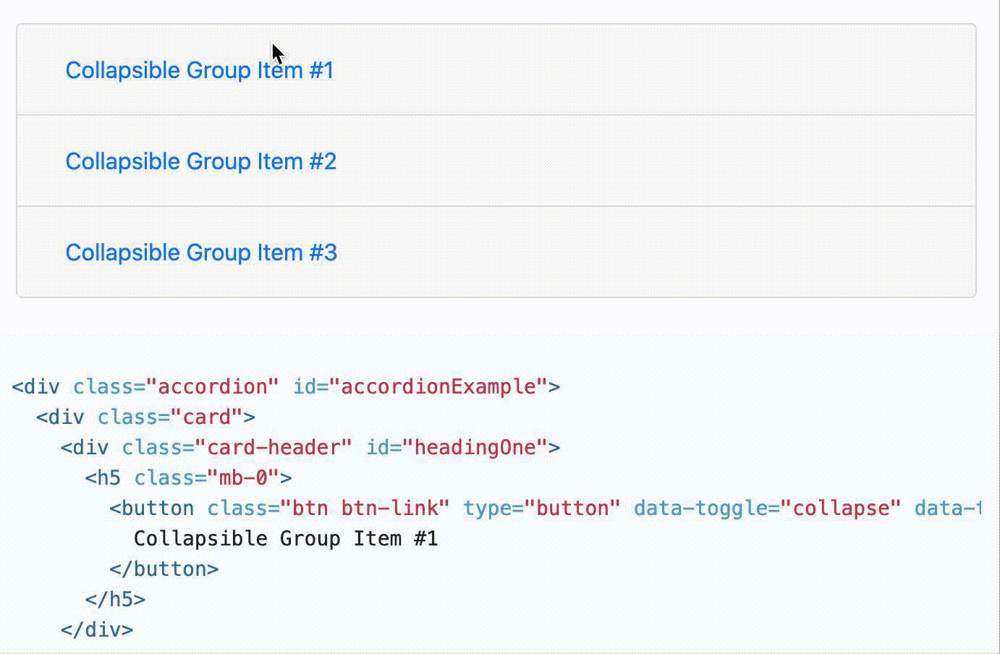

仕事でCSS等を書いていても、時間が限られていたりタスクに忙殺されてしまって、丁寧な仕事ができなかったりすることが多い。要件として顧客に求められている機能の実装だけでいっぱいいっぱいになりがちだったりする。なんとも不甲斐ない…。

しかしこの個人ブログは完全に自分のものであるし、この機会に普段あまりしっかり対応できないようなところまで手を入れてみようと思った。かねてより印刷時のCSSの調整方法が気になっていたので、今回この場で実践してみようと思った。

PC/タブレット/スマホのディスプレイに表示されたウェブサイトは、ユーザーによるクリック/タップ/マウスホバー等の動作によってインタラクティブに情報が扱われる。しかし紙に印刷されたそれは、情報端末で表示されたものと大きく前提が異なる。クリック/タップ/マウスホバーの概念はないし、印刷には紙やインクという物理的な資源を消費する。

本記事では印刷に対応したCSSの書き方を模索する。誰かの参考になれば幸いである。


## 印刷対応CSSの書き方

### 印刷専用のCSSファイルを用意し、HTMLの `<head>` 内で読み込ませる

方法1つ目。シンプルな方法だが、一つのセレクタのスタイルをディスプレイ・印刷両方で調整する必要が出た場合、それぞれのCSSファイルを同時に編集する必要がある。

```html
<link rel="stylesheet" media="print" href="print.css">
```

### CSSファイル内に、メディアクエリを使って書き分ける

もう一つの方法。一つのファイル内においてセレクタに当たるスタイルをメディアクエリで調整するやり方。個人的にはこちらが好み。

```css
.hoge {
  background-color: #000;
}
@media print {
  .hoge {
    background-color: #fff;
  }
}
```

CSS以外での対応方法は以下の記事が詳しい。

- [ホームページの印刷対策 [無料ホームページ作成クラウドサービス　まめわざ]]( https://mamewaza.com/support/blog/web-for-printing.html )


また、Chromeをつかった印刷用CSSのデバッグ方法が以下の記事にまとめられている。ただし、ブラウザ内の表示とプレビュー表示とで差異が発生するケースも有るため、最終的にはPDFなり紙なりに出力して確認すべし。

- [Chromeでmedia printを確認・デバッグする方法 | 株式会社CONFRAGE ITソリューション事業部]( https://confrage.jp/chrome%E3%81%A7media-print%E3%82%92%E7%A2%BA%E8%AA%8D%E3%83%BB%E3%83%87%E3%83%90%E3%83%83%E3%82%B0%E3%81%99%E3%82%8B%E6%96%B9%E6%B3%95/ )


## 省インク対応

ここから本編。

基本的にプリンターで紙に印刷する際、真っ白な紙にCMYKのインクでプリントアウトしていくことになる。ということは、黒背景に白文字というページはインク消費量的な面で最悪であり、エンドユーザーに不要なコストを支払わせることになる。

例えば、本ブログで採用しているHugoテーマとシンタックスハイライトでは以下のように表示される。また、このコードは実際に本ブログに反映した、省インク対応の一部である。

```css
@media print {
    .logo__img,
    .post__thumbnail,
    .widget-search__form,
    .authorbox__avatar{
        display: none;
    }
    .list__footer-readmore,
    .toc__title,
    .tags__item,
    .widget-taglist__link,
    .widget-social__link,
    svg,
    .highlight pre{
        color: #333 !important;
        fill: #333 !important;
        background-color: #fff !important;
    }
}
```

`@media print` というメディアクエリを使って、シンタックスハイライトの箇所を含め黒背景になっているところを白背景黒文字に設定した。また、記事以外の画像（メインビジュアル）は印刷時には不要と判断して非表示に設定した。

下の画像は実際にPDFで出力してみたシンタックスハイライト箇所である。上記と同じ内容だが、白背景になって省インクが期待できる結果となった。



## リンク可視化対応

印刷を行うといくつかの情報が欠落してしまうケースが有り、特に `<a href="">` で表されるリンク先の情報はその最たる例と考えている。リンクテキストにリンク先のタイトルやサイト名が記述されていればまだ手がかりが残されているが、「詳しくはこちら」みたいなリンクテキストだと、印刷した時点でその先の情報にアクセスすることが難しくなる（Accesibilityの面でも「詳しくはこちら」というリンクテキストは避けるべきである）。

この対処法として、印刷時にリンクテキストの真横にURLを表示させてしまうという方法があり、これはCSSで簡単に表現できる。

- [Print URL After Links | CSS-Tricks]( https://css-tricks.com/snippets/css/print-url-after-links/ )

```css
@media print {
  a::after{
    content: " (" attr(href) ") ";
  }
}
```

`attr()` という見慣れないCSS関数があるが、こちらの説明はMDNに記載されている。

-  [attr() - CSS: カスケーディングスタイルシート | MDN]( https://developer.mozilla.org/ja/docs/Web/CSS/attr )

> **`attr()`** は [CSS](https://developer.mozilla.org/ja/docs/Web/CSS) の関数で、選択された要素の属性の値を受け取り、スタイルシートの中で使うために使用されます。[擬似要素](https://developer.mozilla.org/ja/docs/Web/CSS/Pseudo-elements)で使用することもでき、その場合は擬似要素を作る元になった要素の属性値が返されます。

メディアクエリとこのCSS関数を組み合わせることで、印刷時にURLが情報として残されるようになった。以下は印刷時における上記のMDNのリンク。



なお、Bootstrap3にもデフォルトで上記と同じようなCSSが記載されていた（Bootstrap4では見当たらなかった）。

- [Bootstrap v3.3.7 bootstrap.css]( https://maxcdn.bootstrapcdn.com/bootstrap/3.3.7/css/bootstrap.css )

```css
/*!
 * Bootstrap v3.3.7 (http://getbootstrap.com)
 * Copyright 2011-2016 Twitter, Inc.
 * Licensed under MIT (https://github.com/twbs/bootstrap/blob/master/LICENSE)
 */

/* 略 */

@media print {
/* 略 */
a[href]:after {
  content: " (" attr(href) ")"
}
abbr[title]:after {
content: " (" attr(title) ")"
}
a[href^="javascript:"]:after,
a[href^="#"]:after {
  content: ""
}
/* 略 */
}

```


## アコーディオン対応

印刷を行うといくつかの情報が欠落してしまうケースは他にもある。例えば、Bootstrap4のアコーディオンコンポーネントがそれにあたる。ここではアイテムが3段組みになっており、それぞれの段をクリックすることでその段の詳細が現れる（その他は消える）という仕掛けになっている。

- [Collapse - Bootstrap 4.5 - 日本語リファレンス]( https://getbootstrap.jp/docs/4.5/components/collapse/#accordion-example )



しかし、上記のように全ての詳細を確認するためは何度もクリックする必要がある。また、無対策だと印刷時には一つしか表示されないことになり、全て印刷したい場合には3回印刷する手間が発生する（しかも紙のムダにも繋がる）。

上記のコンポーネントだと、非表示になっている詳細の箇所にCSSで `dispay: none;` が充てがわれていて、クリックを検知してCSSが切り替わるという挙動になっている。ということは、上記のメディアクエリを活用して以下のようなCSSを反映させれば良い。

```css
@media print {
  .collapse {
    display: block !important;
  }
}
```


また、Bootstrap4の場合、`.d-print-block` というような印刷時の表示を調整するためのclassも存在している。

- [Display property - Bootstrap 4.5 - 日本語リファレンス]( https://getbootstrap.jp/docs/4.5/utilities/display/ )

> プリントするときは `display` を変更します。
>
> - `.d-print-none`
> - `.d-print-inline`
> - `.d-print-inline-block`
> - `.d-print-block`
> - `.d-print-table`
> - `.d-print-table-row`
> - `.d-print-table-cell`
> - `.d-print-flex`
> - `.d-print-inline-flex`
>
> 表示と印刷のクラスを組み合わせることができます。

これらをうまく活用して、印刷時に必要な情報が隠れてしまうという状態を少しでも無くしていきたい。


## 参考URL

- [印刷 - 開発者ガイド | MDN]( https://developer.mozilla.org/ja/docs/Web/Guide/Printing )
- [@media - CSS: カスケーディングスタイルシート | MDN]( https://developer.mozilla.org/ja/docs/Web/CSS/@media )
- [いままでの印刷、これからの印刷 - ブラウザによって異なる印刷対応状況 | CodeGrid]( https://app.codegrid.net/entry/2016-print-1 )
- [ホームページの印刷対策 [無料ホームページ作成クラウドサービス　まめわざ]]( https://mamewaza.com/support/blog/web-for-printing.html )
- [そろそろ真面目に、HTMLで帳票を描く話をしようか - Qiita]( https://qiita.com/cognitom/items/d39d5f19054c8c8fd592 )
- [印刷用CSS(@media print)の設定とデバッグ方法って? HTMLの印刷崩れを解決 | 初代編集長ブログ―安田英久 | Web担当者Forum]( https://webtan.impress.co.jp/e/2015/07/28/20508 )
- [Print URL After Links | CSS-Tricks]( https://css-tricks.com/snippets/css/print-url-after-links/ )
- [リンクのURLを欄外に配置して印刷する — terkel.jp]( https://terkel.jp/archives/2017/07/print-link-urls-as-sidenotes/ )

