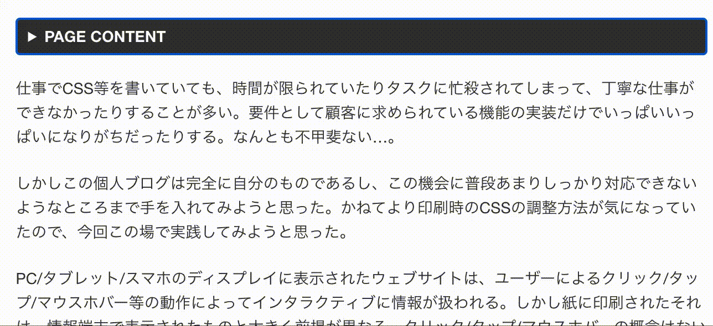
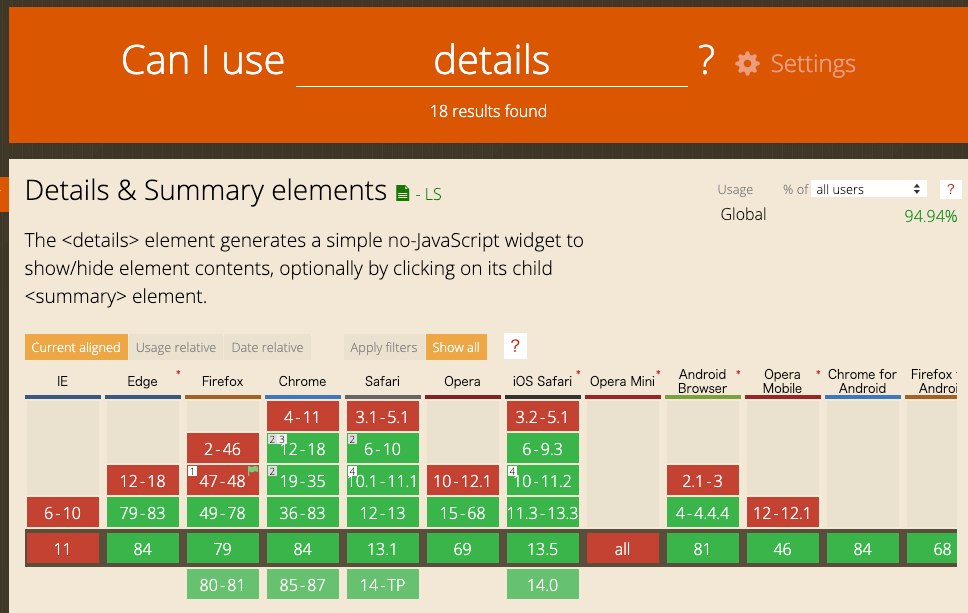

本ブログでは[Mainroad]( https://github.com/Vimux/Mainroad/ )というHugoテーマを利用しているが、ちょいちょい修正したい箇所があるために最近ちまちまとスタイルなどをアップデートしている。

そのうちの一つに目次機能をアコーディオンみたいな折りたたみ機能を持たせたいと思っていたので、これを機に実装してみることにした。そこで比較的新しいHTML要素である `details` というタグを使って見ることにした。

## そもそも `details` 要素とは

説明はMDNに丸投げする😇

- [&lt;details&gt; : 詳細折りたたみ要素 - HTML: HyperText Markup Language | MDN]( https://developer.mozilla.org/ja/docs/Web/HTML/Element/details )

> **HTML の詳細折りたたみ要素** (**`<details>`**) は、ウィジェットが open 状態になった時のみ情報が表示される折りたたみウィジェットを作成します。概要やラベルは [`<summary>`](https://developer.mozilla.org/ja/docs/Web/HTML/Element/summary) 要素を使用して提供することができます。
> 折りたたみウィジェットはふつう、回転して開閉状態を示す小さな三角形を使用し、その隣のラベルと共に画面上に表現されます。 `<details>` 要素の最初の子要素が `<summary>` の場合は、 `<summary>` 要素が折りたたみウィジェットのラベルとして使用されます。

サンプルなどは上記MDNのページ内のデモから確認してほしい。


## HugoのToCモジュールをカスタマイズする

Hugo自体にToCモジュールが用意されており、ここで記事上部の目次表示の設定が行われている。

- [Table of Contents | Hugo]( https://gohugo.io/content-management/toc/ )

なお、ToCは「table of contents」の非公式な省略形で、いわゆる目次と同じ意味である。

- [Table of contents - Wikipedia]( https://en.wikipedia.org/wiki/Table_of_contents )

> A **table of contents,** usually headed simply **Contents** and abbreviated informally as **TOC

例えば、Mainroadテーマを利用している場合、`./themes/mainroad/layouts/partials/post_toc.html`にToCモジュールのHTMLファイルが配置されている。このファイルを `./layouts/partials/post_toc.html` に配置し直し、コードを `details` と `summary` 要素を使って書き直した。この再配置により、Hugoのオーバーライドの仕組みによって優先的にHTMLが読み込まれるようになる。

### Before

```html
<!-- before -->
<!-- ./themes/mainroad/layouts/partials/post_toc.html -->
{{ if .Param "toc" }}
<div class="post__toc toc">
	<div class="toc__title">{{ T "toc_title" }}</div>
	<div class="toc__menu">
		{{ .TableOfContents }}
	</div>
</div>
{{ end }}
```


### After

```html
<!-- after -->
<!-- ./layouts/partials/post_toc.html -->
{{ if .Param "toc" }}
<details class="post__toc toc">
	<summary class="toc__title">{{ T "toc_title" }}</summary>
	<div class="toc__menu">
		{{ .TableOfContents }}
	</div>
</details>
{{ end }}
```



簡単なHTMLの書き換えだけで折りたたみ機能が実装できた。また、この要素はクリック/タップだけでなくキーボードでも開閉可能なので、Accessibility面でも嬉しい。


## `details` 要素導入時に気をつけたこと

HTMLだけ書き換えてハイおしまい！…としたかったところだが、更に少し修正を加えることにした。

### クリックして利用する要素なのに、マウスホバーでカーソルが変化しない@Chrome

上記のGIFアニメーションで、PAGE CONTENTにマウスホバーした時にクリッカブルな状態を表す手のアイコンに切り替わっているが、実はこれは（少なくともChrome バージョン: 84では）デフォルトだとただの矢印のままである。なので以下のようなCSSを書き加えることにした。

```css
summary{
    cursor: pointer;
}
```


### 印刷時に強制的に展開された状態にする

[前回の記事]( /post/2020/08/20/css_for_printing/ )でも紹介したが、印刷時にコンテンツが折りたたまれた状態だと情報が欠落するという問題がある。`details` 要素でもこの問題が発生してしまうが、これを解決するには現状だとJavaScriptの力を借りる必要があるようだ。下記のStack Overflowに解決策のコードが載っていたが、jQuery前提の記述だったのでVanilla JSで表記し直した。

- [css - Force open the details / summary tag for Print in Chrome - Stack Overflow]( https://stackoverflow.com/questions/19646684/force-open-the-details-summary-tag-for-print-in-chrome )

```javascript
const beforePrint = () => {
  document.querySelectorAll('details').forEach(d => d.setAttribute('open', ''));
};
const afterPrint = () => {
  document.querySelectorAll('details').forEach(d => d.removeAttribute('open'));
};

if (window.matchMedia) {
  const mediaQueryList = window.matchMedia('print');
  mediaQueryList.addListener(mql => {
    if (mql.matches) {
      beforePrint();
    } else {
      afterPrint();
    }
  });
}

window.onbeforeprint = beforePrint;
window.onafterprint = afterPrint;
```

これで自動的に展開された状態で印刷される状態にできた。

## IE？なにそれおいしいの？

IEではや古いEdgeだと使えないけど、まいっか…。気が向いたらポリフィルを入れておこう。




## 参考URL

- [<details>: 詳細折りたたみ要素 - HTML: HyperText Markup Language | MDN]( https://developer.mozilla.org/ja/docs/Web/HTML/Element/details )
- [Hugoのテーマを何個か作ったので知見をまとめてみる - blog.unresolved.xyz]( https://blog.unresolved.xyz/how-to-make-of-hugo-theme )
- [cursor - CSS: カスケーディングスタイルシート | MDN]( https://developer.mozilla.org/ja/docs/Web/CSS/cursor )
- [css - Force open the details / summary tag for Print in Chrome - Stack Overflow]( https://stackoverflow.com/questions/19646684/force-open-the-details-summary-tag-for-print-in-chrome )
- [rstacruz/details-polyfill: Polyfill for the HTML5 <details> element, no dependencies]( https://github.com/rstacruz/details-polyfill )

