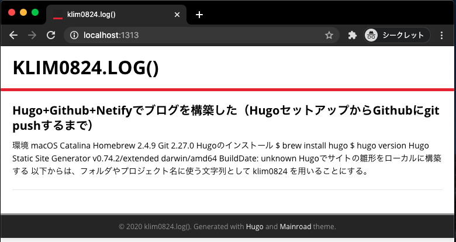
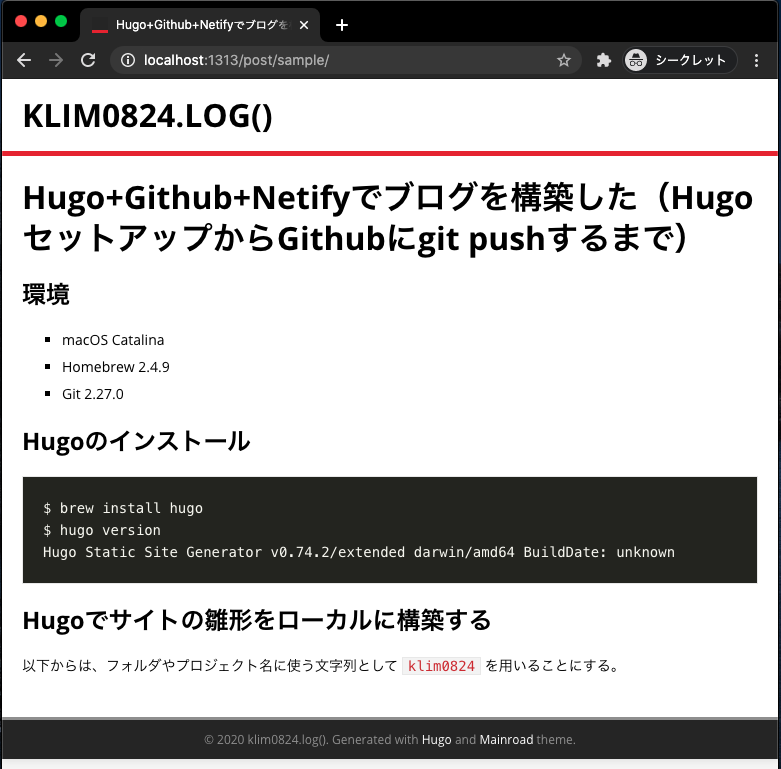

色々思うところがあって、Hugoでブログを構築することに決めた。今までははてなブログに少しだけ記事を投稿していたけれど、どうせなら1から作ってみようと思ったのだった。

- [Quick Start | Hugo]( https://gohugo.io/getting-started/quick-start/#step-2-create-a-new-site )


## 想定環境

```bash
$ sw_vers
ProductName:	Mac OS X
ProductVersion:	10.15.6  # catalina
BuildVersion:	19G73

$ brew -v
Homebrew 2.4.9
Homebrew/homebrew-core (git revision edab7; last commit 2020-08-04)
Homebrew/homebrew-cask (git revision 8677d; last commit 2020-08-04)

$ git --version
git version 2.27.0
```

- GitHubのアカウントは取得済み かつ 基本的な操作は把握済み


## Hugoのインストール

macOSを利用している開発者だと高確率で [Homebrew]( https://brew.sh/index_ja ) を利用されているかと思うので、Hugoのインストールもこれを用いて行う。

```bash
$ brew install hugo
$ hugo version
Hugo Static Site Generator v0.74.2/extended darwin/amd64 BuildDate: unknown
```

他の環境を利用されている方は以下を参照のこと。

- [Install Hugo | Hugo]( https://gohugo.io/getting-started/installing )


## Hugoでサイトの雛形をローカルに構築する

以下からは、フォルダやプロジェクト名に使う文字列として `klim0824` を用いることにする。

```bash
$ hugo new site klim0824
```

これを叩くことによって、 `klim0824` ディレクトリが生成され、そのディレクトリ内に雛形が生成される。
すでにプロジェクト名のディレクトリを作成済み & そのディレクトリ内に移動している場合は以下のように `.` を用いる。

```bash
$ hugo new site .
```


`hugo new site` を叩くと、以下のようにファイルが生成される。

```bash
$ cd klim0824 
$ tree  # カレントディレクトリ以下の階層を表示してくれる。 brew install tree でインストール。
.
├── archetypes
│   └── default.md
├── config.toml
├── content
├── data
├── layouts
├── static
└── themes
```

```bash
$ cat archetypes/default.md
---
title: "{{ replace .Name "-" " " | title }}"
date: {{ .Date }}
draft: true
---

```

```bash
$ cat config.toml
baseURL = "http://example.org/"
languageCode = "en-us"
title = "My New Hugo Site"
```

`archetypes/default.md` は記事の作成時に反映されるテンプレートで、`config.toml` はサイト全体の設定を行うためのファイル。
これだけだと何もないも同然なので、記事の作成とテーマ設定を行う。まずはテーマから。


## Hugoのテーマを適用する

今回はMainroadというテーマを適用することにした。

- [Mainroad | Hugo Themes]( https://themes.gohugo.io/mainroad/ )
  - [Mainroad Demo]( https://themes.gohugo.io/theme/mainroad/ )
  - [Vimux/Mainroad GitHub]( https://github.com/Vimux/mainroad )

基本的に `themes/[テーマ名]` ディレクトリを作成し、その中にテーマのファイルを配置する流れになるが、単に `git clone` するだけだと、サイトの設定や記事をGitで管理する時にそのテーマ自体も配下に含まれてしまう。
できるなら `git submodule` を活用して、サイト本体の管理とテーマの管理を分離しておきたい。こうすることで、テーマはテーマの配信元で管理されるようになり、自らがわざわざ管理する必要はなくなる。

- [Git - サブモジュール]( https://git-scm.com/book/ja/v2/Git-%E3%81%AE%E3%81%95%E3%81%BE%E3%81%96%E3%81%BE%E3%81%AA%E3%83%84%E3%83%BC%E3%83%AB-%E3%82%B5%E3%83%96%E3%83%A2%E3%82%B8%E3%83%A5%E3%83%BC%E3%83%AB )

という訳で、叩くコマンドは以下のとおり。
`git submodule` を叩く際、レポジトリのURLの次に保存先のディレクトリ名（今回は `themes/mainroad`）を指定するのをお忘れなく。

```bash
$ git init
$ git submodule add https://github.com/Vimux/Mainroad.git themes/mainroad
```


すると以下のようなファイル構成になる（見やすさのため、3階層目まで表示）。

```bash
$ tree -a -L 3  # -aは隠しファイルやディレクトリも表示させるオプション。-L 3は3階層目まで表示するオプション。
.
├── .git
│   └ 省略
├── .gitmodules
├── archetypes
│   └── default.md
├── config.toml
├── content
├── data
├── layouts
├── static
└── themes
    └── mainroad
        ├── CONTRIBUTING.md
        ├── LICENSE.md
        ├── README.md
        ├── archetypes
        ├── assets
        ├── exampleSite
        ├── i18n
        ├── images
        ├── layouts
        ├── package-lock.json
        ├── package.json
        ├── static
        └── theme.toml
```


ここまで来たら、次に `config.toml` にテーマを指定する記述を追加する（4行目）。値には `themes` ディレクトリ配下のディレクトリ名を用いる。

ついでに、 `languageCode` を日本語対応に、 `title` にはサイト名を設定する。

```toml
baseURL = "http://example.org/"
languageCode = "ja"
title = "klim0824.log()"
theme = "mainroad"
```

`config.toml` に様々な設定を追加・編集することになるが、今は一旦先に進める。[^1]

[^1]: 筆者は[Visual Studio Code](https://azure.microsoft.com/ja-jp/products/visual-studio-code/)でソースを編集しているが、.tomlファイルのシンタックスハイライトには[Better TOML]( https://marketplace.visualstudio.com/items?itemName=bungcip.better-toml )を利用している。


## 記事を追加する

記事を追加するには `hugo new` を叩く。

```bash
$ hugo new post/sample/index.md
```


すると、 `content` ディレクトリ配下に `post/sample/index.md` が生成されている。

```bash
$ tree -a -L 3
.
├── .git
│   └ 省略
├── .gitmodules
├── archetypes
│   └── default.md
├── config.toml
├── content
│   └── post
│       └── sample
│          └── index.md   ←ココ!
├── data
├── layouts
├── resources             ←ココも追加されているけれど今回はスルーで
│   └── _gen
│       ├── assets
│       └── images
├── static
└── themes
    └── mainroad
        └── 省略
```


生成された `post/sample/index.md` の中身はこちら。
`$ cat archetypes/default.md` の中身と対応していることがお分かり頂けると思う。

```markdown
---
title: "Sample"
date: 2020-08-01T21:41:24+09:00
draft: true
---
```


`draft` の箇所は下書きの意味。ここを `false` にするか、1行丸々削除すると本公開用の記事になる。
以下のように記事を書いていく。少なくともMainroadテーマでは `title` がHTML上の `<h1>` に相当するので、記事内の見出しはHTMLの `<h2>` 相当である `##` から始めると良い。

```markdown
---
title: "Hugo+GitHub+Netifyでブログを構築した（HugoセットアップからGitHubにgit pushするまで）"
date: 2020-08-01T20:12:07+09:00
draft: false
---

## 環境

- macOS Catalina
- Homebrew 2.4.9
- Git 2.27.0

## Hugoのインストール

​```bash
$ brew install hugo
$ hugo version
Hugo Static Site Generator v0.74.2/extended darwin/amd64 BuildDate: unknown
​```

## Hugoでサイトの雛形をローカルに構築する

以下からは、フォルダやプロジェクト名に使う文字列として `klim0824` を用いることにする。
.
.
.

```


## ローカルサーバーを立ち上げてプレビューする

ここまで来たらいよいよブラウザで表示を確認できる。

```bash
$ hugo server 
```

`draft: true` で下書き設定している記事もプレビューしたい場合は `-D` オプションを付ける。

```bash
$ hugo server -D
```

コマンドを叩くと以下のように表示される。

```bash
$ hugo server -D

# ここにWARNが表示されるけど今回はスルーで

                   | EN  
-------------------+-----
  Pages            |  4  
  Paginator pages  |  0  
  Non-page files   |  0  
  Static files     |  0  
  Processed images |  0  
  Aliases          |  0  
  Sitemaps         |  1  
  Cleaned          |  0  

Built in 5 ms
Watching for changes in /Users/USER/projectpath/klim0824/{archetypes,content,data,layouts,static}
Watching for config changes in /Users/USER/projectpath/klim0824/config.toml
Environment: "development"
Serving pages from memory
Running in Fast Render Mode. For full rebuilds on change: hugo server --disableFastRender
Web Server is available at http://localhost:1313/ (bind address 127.0.0.1)
Press Ctrl+C to stop


```


この状態で `http://localhost:1313/` にアクセスすると以下のような感じに表示される。

- TOP（http://localhost:1313/）
	- 

  

- 記事（http://localhost:1313/post/sample/）
	
	- 

やったぜ！


## Githibにレポジトリを作成 & git push

GitHubにリポジトリを作成する具体的な方法は割愛。ここではリポジトリを作成し終わって、 `git@github.com:klim0824/klim0824.git` というURLを生成したという体で話を進める。

これまでの作業を `git commit` しておく（テーマをcloneした時点で `git init` しているため、すんなりgitコマンドが通るようになっている）。そして、 `git remote add origin` でリモートリポジトリを登録しておき、最後は `git push` する。

```bash
$ git add .
$ git commit -m "Initial Commit"
$ git remote add origin git@github.com:klim0824/klim0824.git
$ git push origin master
```

## 感想
思いの外簡単にサイト構築が進められて大変DX（開発体験）が高くて素晴らしい！
一方で、自由度が比較的高い仕様ということもあり、導入するテーマによって設定箇所やその作法が大きく異なるようにも感じた。今回はMainroadというテーマを選んでこの記事を書いたが、これ以前に様々なテーマを選択して試行錯誤していた（中には記事やテーマを表示するところまで行けなかったテーマもあった）。ここらへんは単純になれの問題なのかもしれない。

ご覧の通り、Mainroadというテーマを使ってこのブログも構築することにしているが、まだまだ設定が甘いと感じている。8月中にはサマになるようなUIを目指したい。


## todo
- `config.toml` を鍛える
- HTML/CSS/JavaScriptを追加・編集する
- GitHubとNetlifyへの連携
- NetlifyとSlackをIFTTT経由で無料で連携
- はてなブログからいくつか記事をインポート

## 参考URL
- [Install Hugo | Hugo]( https://gohugo.io/getting-started/installing )
- [Quick Start | Hugo]( https://gohugo.io/getting-started/quick-start/#step-2-create-a-new-site )
- [Git - サブモジュール]( https://git-scm.com/book/ja/v2/Git-%E3%81%AE%E3%81%95%E3%81%BE%E3%81%96%E3%81%BE%E3%81%AA%E3%83%84%E3%83%BC%E3%83%AB-%E3%82%B5%E3%83%96%E3%83%A2%E3%82%B8%E3%83%A5%E3%83%BC%E3%83%AB )

- [Hugo で新規の Web サイトを作成する | まくまくHugo/Goノート]( https://maku77.github.io/hugo/basic/create-site.html )
  - 書いてから読み返すと、ほぼ内容が一緒…独自性が薄くてすみません😓	
- [Hugo によるブログ作成と mainroad テーマのカスタマイズ - terashim.com]( https://terashim.com/posts/create-hugo-blog-and-customize-mainroad-theme/ )
  - 「`config.toml` を鍛える」というtodoに思いっきり関連する内容
- [Hugoのテーマを何個か作ったので知見をまとめてみる - blog.unresolved.xyz]( https://blog.unresolved.xyz/how-to-make-of-hugo-theme )


